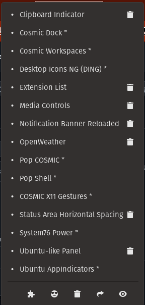

Setting for changing dock transparency

```
gsettings set org.gnome.shell.extensions.dash-to-dock background-opacity 0.4
```




# For mounting ext.drives:

For list view
```
sudo fdsik -l
```
To get UUID:
```
blkid
```
To automount:
```
sudo vim/nano /etc/fstab
```
Then add:
```
UUID-xxxxxx mount_point type(probably ntfs-3g) 0 0 0
```
Setting form online tutorial
```UUID=40e554eb-6421-4813-88ea-3882a3a7a153 /mnt/Disk auto nosuid,nodev,nofail,x-gvfs-show 0 0```
Then ``` sudo mount -a```
